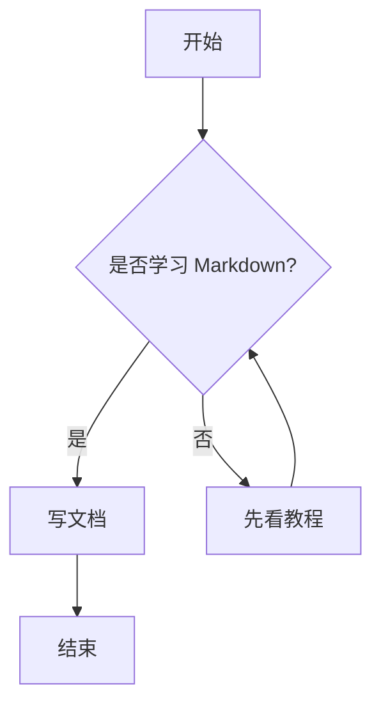
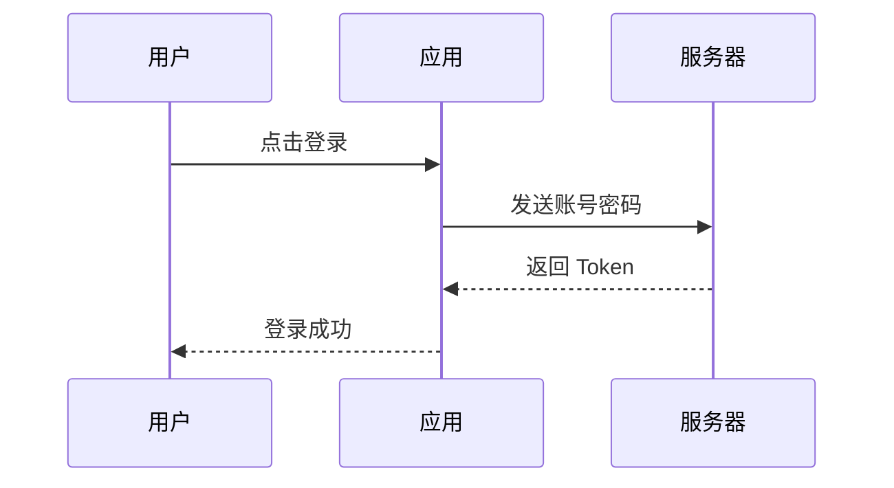
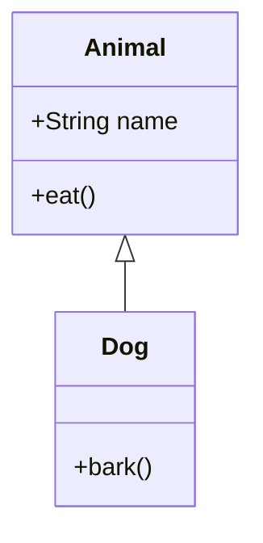
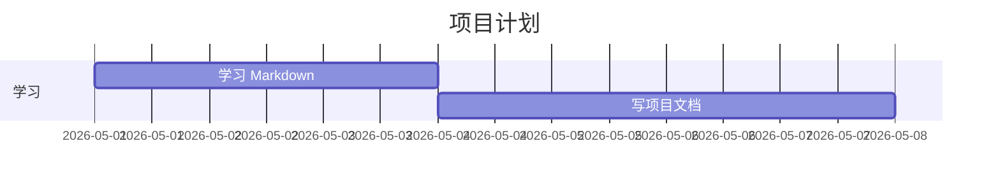

# Markdown 语法详细教程

> 适合零基础学习，也适合作为日常写笔记、写 README、写博客、写实验报告、写项目文档的速查手册。

---

## 目录

- [1. Markdown 是什么](#1-markdown-是什么)
- [2. Markdown 的基本特点](#2-markdown-的基本特点)
- [3. 标题](#3-标题)
- [4. 段落与换行](#4-段落与换行)
- [5. 加粗、斜体、删除线](#5-加粗斜体删除线)
- [6. 分割线](#6-分割线)
- [7. 引用](#7-引用)
- [8. 列表](#8-列表)
- [9. 任务列表](#9-任务列表)
- [10. 代码与代码块](#10-代码与代码块)
- [11. 链接](#11-链接)
- [12. 图片](#12-图片)
- [13. 表格](#13-表格)
- [14. 转义字符](#14-转义字符)
- [15. 数学公式](#15-数学公式)
- [16. HTML 混写](#16-html-混写)
- [17. 脚注](#17-脚注)
- [18. 目录与锚点](#18-目录与锚点)
- [19. 注释](#19-注释)
- [20. 常见扩展语法](#20-常见扩展语法)
- [21. Mermaid 图表](#21-mermaid-图表)
- [22. Markdown 写作规范](#22-markdown-写作规范)
- [23. 常见用途模板](#23-常见用途模板)
- [24. 常见问题](#24-常见问题)
- [25. Markdown 速查表](#25-markdown-速查表)

---

# 1. Markdown 是什么

Markdown 是一种轻量级标记语言。它的核心思想是：

> 用简单的纯文本符号来表达文档结构和格式。

例如：

```markdown
# 一级标题

这是一个段落。

- 列表项 1
- 列表项 2

**这是加粗文字**
```

渲染之后会变成：

# 一级标题

这是一个段落。

- 列表项 1
- 列表项 2

**这是加粗文字**

Markdown 常用于：

- GitHub 项目的 `README.md`
- 技术博客
- 学习笔记
- 项目文档
- 实验报告
- 软件说明书
- Obsidian、Typora、VS Code 笔记
- 文档网站，如 VuePress、Docusaurus、MkDocs

---

# 2. Markdown 的基本特点

## 2.1 优点

Markdown 的优点主要有：

1. **简单易学**：只需要记少量符号。
2. **纯文本格式**：可以用任何文本编辑器打开。
3. **适合版本管理**：非常适合 Git 追踪修改。
4. **跨平台**：GitHub、Gitee、Obsidian、Typora、VS Code 都支持。
5. **可导出多种格式**：可以转成 HTML、PDF、Word、PPT 等。

## 2.2 缺点

Markdown 也不是万能的：

1. 不同平台对扩展语法支持不完全一致。
2. 对复杂排版的支持不如 Word。
3. 表格、复杂公式、复杂布局不够方便。
4. 原生 Markdown 不支持设置字体、字号、颜色等复杂样式。

## 2.3 文件后缀

Markdown 文件通常使用：

```text
.md
.markdown
```

最常见的是 `.md`。

---

# 3. 标题

Markdown 使用 `#` 表示标题。

## 3.1 基本语法

```markdown
# 一级标题
## 二级标题
### 三级标题
#### 四级标题
##### 五级标题
###### 六级标题
```

效果如下：

# 一级标题
## 二级标题
### 三级标题
#### 四级标题
##### 五级标题
###### 六级标题

## 3.2 标题写法建议

推荐写法：

```markdown
# 标题内容
```

不推荐写法：

```markdown
#标题内容
```

因为有些 Markdown 解析器要求 `#` 和标题文字之间必须有空格。

## 3.3 标题层级建议

写正式文档时建议：

```markdown
# 文档标题

## 第一章

### 1.1 小节

### 1.2 小节

## 第二章
```

不要跳级使用标题，例如不要从 `#` 直接跳到 `####`。

---

# 4. 段落与换行

## 4.1 普通段落

Markdown 中，连续的一段文字就是一个段落。

```markdown
这是第一段文字。

这是第二段文字。
```

渲染效果：

这是第一段文字。

这是第二段文字。

注意：两个段落之间需要空一行。

## 4.2 普通换行

Markdown 中直接按一次回车，有些平台不会真正换行。

例如：

```markdown
第一行
第二行
```

有些平台会显示成：

```text
第一行 第二行
```

如果想强制换行，有两种方式。

## 4.3 方法一：行尾加两个空格

```markdown
第一行  
第二行
```

注意：第一行结尾有两个空格。

## 4.4 方法二：使用 `<br>` 标签

```markdown
第一行<br>
第二行
```

效果：

第一行<br>
第二行

在技术文档中，更推荐通过空行分段，而不是频繁手动换行。

---

# 5. 加粗、斜体、删除线

## 5.1 加粗

```markdown
**加粗文字**
__加粗文字__
```

效果：

**加粗文字**

__加粗文字__

推荐使用 `**加粗文字**`。

## 5.2 斜体

```markdown
*斜体文字*
_斜体文字_
```

效果：

*斜体文字*

_斜体文字_

推荐使用 `*斜体文字*`。

## 5.3 加粗加斜体

```markdown
***加粗且斜体***
```

效果：

***加粗且斜体***

## 5.4 删除线

```markdown
~~这是删除线~~
```

效果：

~~这是删除线~~

删除线属于 GitHub Flavored Markdown 扩展语法，大多数现代编辑器都支持。

## 5.5 使用建议

- 重点内容用加粗。
- 专业术语或强调语气可用斜体。
- 过期内容、废弃内容可用删除线。
- 不要整段文字全部加粗，否则会降低可读性。

---

# 6. 分割线

Markdown 可以用三个或更多的 `-`、`*`、`_` 表示分割线。

```markdown
---

***

___
```

效果：

---

通常推荐使用：

```markdown
---
```

分割线适合用于章节之间的视觉分隔。

---

# 7. 引用

## 7.1 单行引用

使用 `>` 表示引用。

```markdown
> 这是一段引用内容。
```

效果：

> 这是一段引用内容。

## 7.2 多行引用

```markdown
> 第一行引用
> 第二行引用
> 第三行引用
```

效果：

> 第一行引用
> 第二行引用
> 第三行引用

## 7.3 嵌套引用

```markdown
> 一级引用
>> 二级引用
>>> 三级引用
```

效果：

> 一级引用
>> 二级引用
>>> 三级引用

## 7.4 引用中使用其他语法

引用中也可以使用加粗、列表、代码等。

```markdown
> **注意：** 这是一条重要提示。
>
> - 第一点
> - 第二点
```

效果：

> **注意：** 这是一条重要提示。
>
> - 第一点
> - 第二点

## 7.5 引用使用场景

引用常用于：

- 摘录原文
- 写注意事项
- 写提示信息
- 写警告说明
- 写结论性总结

---

# 8. 列表

列表分为无序列表和有序列表。

---

## 8.1 无序列表

无序列表可以使用 `-`、`*`、`+`。

```markdown
- 苹果
- 香蕉
- 橘子
```

效果：

- 苹果
- 香蕉
- 橘子

也可以写成：

```markdown
* 苹果
* 香蕉
* 橘子
```

或者：

```markdown
+ 苹果
+ 香蕉
+ 橘子
```

推荐统一使用 `-`，可读性最好。

---

## 8.2 有序列表

```markdown
1. 第一步
2. 第二步
3. 第三步
```

效果：

1. 第一步
2. 第二步
3. 第三步

即使你写成下面这样，大多数 Markdown 渲染器也会自动编号：

```markdown
1. 第一步
1. 第二步
1. 第三步
```

效果通常仍然是：

1. 第一步
1. 第二步
1. 第三步

这种写法适合后续插入新条目，不需要手动改编号。

---

## 8.3 嵌套列表

嵌套列表通常使用两个或四个空格缩进。

```markdown
- 前端
  - HTML
  - CSS
  - JavaScript
- 后端
  - Node.js
  - Python
  - Java
```

效果：

- 前端
  - HTML
  - CSS
  - JavaScript
- 后端
  - Node.js
  - Python
  - Java

对于有序列表也一样：

```markdown
1. 学习基础语法
   1. 标题
   2. 段落
   3. 列表
2. 学习高级语法
   1. 表格
   2. 数学公式
   3. Mermaid 图表
```

效果：

1. 学习基础语法
   1. 标题
   2. 段落
   3. 列表
2. 学习高级语法
   1. 表格
   2. 数学公式
   3. Mermaid 图表

---

## 8.4 列表中嵌入代码块

列表中嵌入代码块时，代码块需要缩进。

````markdown
1. 安装依赖：

   ```bash
   npm install
   ```

2. 启动项目：

   ```bash
   npm run dev
   ```
````

效果：

1. 安装依赖：

   ```bash
   npm install
   ```

2. 启动项目：

   ```bash
   npm run dev
   ```

---

# 9. 任务列表

任务列表常用于 TODO 清单。

```markdown
- [x] 完成 Markdown 基础学习
- [x] 学会写表格
- [ ] 学会写数学公式
- [ ] 学会写 Mermaid 图
```

效果：

- [x] 完成 Markdown 基础学习
- [x] 学会写表格
- [ ] 学会写数学公式
- [ ] 学会写 Mermaid 图

注意：

- `[x]` 表示已完成。
- `[ ]` 表示未完成。
- 中间必须有空格。

错误写法：

```markdown
-[x]错误
- []错误
```

推荐写法：

```markdown
- [x] 正确
- [ ] 正确
```

---

# 10. 代码与代码块

Markdown 对程序员非常友好，因为它可以方便地写代码。

---

## 10.1 行内代码

使用反引号包裹行内代码。

```markdown
在 Python 中，可以使用 `print()` 输出内容。
```

效果：

在 Python 中，可以使用 `print()` 输出内容。

常见用途：

- 函数名：`main()`
- 变量名：`count`
- 文件名：`README.md`
- 命令：`git status`
- 路径：`/home/user/project`

---

## 10.2 多行代码块

使用三个反引号包裹代码块。

````markdown
```python
def hello():
    print("Hello Markdown")
```
````

效果：

```python
def hello():
    print("Hello Markdown")
```

---

## 10.3 指定代码语言

在代码块开头的三个反引号后面写语言名称，可以启用语法高亮。

常见语言标识：

```markdown
```python
```

```javascript
```

```java
```

```c
```

```cpp
```

```bash
```

```json
```

```html
```

```css
```

```sql
```
```

示例：

````markdown
```javascript
const name = "Markdown";
console.log(name);
```
````

效果：

```javascript
const name = "Markdown";
console.log(name);
```

---

## 10.4 写命令行代码

```markdown
```bash
cd my-project
npm install
npm run dev
```
```

效果：

```bash
cd my-project
npm install
npm run dev
```

---

## 10.5 代码块中显示反引号

如果代码块中本身包含三个反引号，可以用四个反引号包裹。

`````markdown
````markdown
```python
print("hello")
```
````
`````

这在写 Markdown 教程时非常常用。

---

# 11. 链接

---

## 11.1 行内链接

```markdown
[百度](https://www.baidu.com)
```

效果：

[百度](https://www.baidu.com)

语法结构：

```markdown
[显示文字](链接地址)
```

---

## 11.2 带标题的链接

```markdown
[百度](https://www.baidu.com "百度搜索")
```

当鼠标悬停在链接上时，可能会显示标题。

---

## 11.3 自动链接

```markdown
<https://www.github.com>
```

效果：

<https://www.github.com>

邮箱也可以：

```markdown
<example@example.com>
```

效果：

<example@example.com>

---

## 11.4 引用式链接

当一个链接在文档中多次出现时，可以使用引用式链接。

```markdown
这是 [GitHub][github] 的链接。

你也可以再次访问 [GitHub][github]。

[github]: https://github.com
```

效果：

这是 [GitHub][github] 的链接。

你也可以再次访问 [GitHub][github]。

[github]: https://github.com

这种写法适合长文档，可以让正文更清爽。

---

## 11.5 页面内部跳转

Markdown 中可以链接到当前文档的某个标题。

```markdown
[跳转到标题章节](#3-标题)
```

效果：

[跳转到标题章节](#3-标题)

注意：不同平台生成锚点的规则可能略有差异。一般规则是：

1. 英文字母转小写。
2. 空格变成 `-`。
3. 删除部分特殊符号。
4. 中文标题一般直接保留。

---

# 12. 图片

图片语法和链接类似，只是前面多一个 `!`。

## 12.1 基本语法

```markdown

```

例如：

```markdown

```

语法结构：

```markdown

```

其中：

- `替代文本`：图片无法显示时出现的说明文字。
- `图片路径`：可以是网络图片地址，也可以是本地图片路径。

---

## 12.2 本地图片

假设你的项目结构如下：

```text
project/
├── README.md
└── images/
    └── demo.png
```

在 `README.md` 中可以这样引用图片：

```markdown

```

---

## 12.3 相对路径与绝对路径

推荐使用相对路径：

```markdown

```

不推荐在项目文档中使用本机绝对路径：

```markdown

```

因为别人打开你的文档时，这个路径通常不存在。

---

## 12.4 调整图片大小

原生 Markdown 不支持直接设置图片宽高，但可以混写 HTML：

```html

```

在一些平台上可以正常显示。

---

## 12.5 图片写作建议

写技术文档时，图片建议放在专门文件夹中：

```text
project/
├── README.md
├── docs/
└── assets/
    ├── architecture.png
    ├── demo.gif
    └── result.png
```

然后在文档中引用：

```markdown

```

---

# 13. 表格

表格是 Markdown 中非常常用但也容易写错的语法。

---

## 13.1 基本表格

```markdown
| 姓名 | 年龄 | 专业 |
|---|---:|---|
| 张三 | 20 | 计算机 |
| 李四 | 21 | 生物医学工程 |
```

效果：

| 姓名 | 年龄 | 专业 |
|---|---:|---|
| 张三 | 20 | 计算机 |
| 李四 | 21 | 生物医学工程 |

---

## 13.2 表格结构

Markdown 表格由三部分组成：

```markdown
| 表头1 | 表头2 |
|---|---|
| 内容1 | 内容2 |
```

其中第二行 `|---|---|` 是必须的，用来分隔表头和表格内容。

---

## 13.3 对齐方式

```markdown
| 左对齐 | 居中对齐 | 右对齐 |
|:---|:---:|---:|
| A | B | C |
| 100 | 200 | 300 |
```

效果：

| 左对齐 | 居中对齐 | 右对齐 |
|:---|:---:|---:|
| A | B | C |
| 100 | 200 | 300 |

规则：

```markdown
|:---|    左对齐
|:---:|   居中对齐
|---:|    右对齐
```

---

## 13.4 表格中使用行内代码

```markdown
| 命令 | 作用 |
|---|---|
| `git status` | 查看当前状态 |
| `git add .` | 添加所有修改 |
| `git commit -m "msg"` | 提交修改 |
```

效果：

| 命令 | 作用 |
|---|---|
| `git status` | 查看当前状态 |
| `git add .` | 添加所有修改 |
| `git commit -m "msg"` | 提交修改 |

---

## 13.5 表格中包含竖线

如果表格内容中包含 `|`，需要转义：

```markdown
| 表达式 | 说明 |
|---|---|
| A \| B | 表示 A 或 B |
```

效果：

| 表达式 | 说明 |
|---|---|
| A \| B | 表示 A 或 B |

---

## 13.6 表格写作建议

1. 表格不要过宽，否则在手机或网页上难以阅读。
2. 表头要简洁。
3. 表格内容较长时，可以改用列表。
4. 对数字列可以使用右对齐。
5. 对比类内容非常适合用表格。

---

# 14. 转义字符

如果你想显示 Markdown 的特殊符号，而不是让它们被解析，就需要转义。

转义使用反斜杠 `\`。

## 14.1 示例

```markdown
\# 这不是标题
\* 这不是斜体
\[这不是链接文字\]
```

效果：

\# 这不是标题

\* 这不是斜体

\[这不是链接文字\]

## 14.2 常见需要转义的字符

```text
\  反斜杠
`  反引号
*  星号
_  下划线
{} 花括号
[] 方括号
() 圆括号
#  井号
+  加号
-  减号
.  英文句点
!  感叹号
|  竖线
```

---

# 15. 数学公式

很多 Markdown 编辑器支持 LaTeX 数学公式，例如 Typora、Obsidian、VS Code 插件、GitHub 部分场景等。

注意：数学公式不是原生 Markdown 的一部分，不同平台支持程度不同。

---

## 15.1 行内公式

使用单个 `$` 包裹公式：

```markdown
这是行内公式：$E = mc^2$。
```

效果通常为：

这是行内公式：$E = mc^2$。

---

## 15.2 块级公式

使用两个 `$$` 包裹公式：

```markdown
$$
E = mc^2
$$
```

效果通常为：

$$
E = mc^2
$$

---

## 15.3 常见数学公式写法

### 分数

```latex
\frac{a}{b}
```

效果：

$$
\frac{a}{b}
$$

### 上标和下标

```latex
x^2
x_i
x_i^2
```

效果：

$$
x^2, \quad x_i, \quad x_i^2
$$

### 求和

```latex
\sum_{i=1}^{n} x_i
```

效果：

$$
\sum_{i=1}^{n} x_i
$$

### 积分

```latex
\int_a^b f(x) dx
```

效果：

$$
\int_a^b f(x) dx
$$

### 矩阵

```latex
\begin{bmatrix}
1 & 2 \\
3 & 4
\end{bmatrix}
```

效果：

$$
\begin{bmatrix}
1 & 2 \\
3 & 4
\end{bmatrix}
$$

### 希腊字母

```latex
\alpha, \beta, \gamma, \theta, \lambda, \mu, \sigma
```

效果：

$$
\alpha, \beta, \gamma, \theta, \lambda, \mu, \sigma
$$

---

## 15.4 深度学习公式示例

均方误差：

```latex
$$
L = \frac{1}{N} \sum_{i=1}^{N} (y_i - \hat{y}_i)^2
$$
```

效果：

$$
L = \frac{1}{N} \sum_{i=1}^{N} (y_i - \hat{y}_i)^2
$$

Softmax：

```latex
$$
\text{softmax}(z_i) = \frac{e^{z_i}}{\sum_{j=1}^{K} e^{z_j}}
$$
```

效果：

$$
\text{softmax}(z_i) = \frac{e^{z_i}}{\sum_{j=1}^{K} e^{z_j}}
$$

---

# 16. HTML 混写

Markdown 允许混写一部分 HTML。

---

## 16.1 换行

```markdown
第一行<br>
第二行
```

---

## 16.2 居中

```html
<div align="center">

# 居中标题

这段文字居中显示。

</div>
```

注意：不是所有平台都完整支持 HTML。

---

## 16.3 图片大小控制

```html

```

---

## 16.4 字体颜色

```html
<span style="color:red">红色文字</span>
```

注意：GitHub 出于安全原因通常不会支持复杂的行内样式。

---

## 16.5 折叠内容

有些平台支持 HTML 的 `<details>` 标签：

```html
<details>
<summary>点击展开</summary>

这里是被折叠的内容。

</details>
```

效果通常为：

<details>
<summary>点击展开</summary>

这里是被折叠的内容。

</details>

这种写法很适合 README 中放较长的说明。

---

# 17. 脚注

脚注用于补充说明。

```markdown
这是一个带脚注的句子。[^1]

[^1]: 这里是脚注内容。
```

效果通常为：

这是一个带脚注的句子。[^1]

[^1]: 这里是脚注内容。

注意：脚注属于扩展语法，不是所有平台都支持。

---

# 18. 目录与锚点

---

## 18.1 手写目录

可以手动写目录：

```markdown
## 目录

- [第一章](#第一章)
- [第二章](#第二章)
- [第三章](#第三章)
```

标题：

```markdown
## 第一章
```

点击 `[第一章](#第一章)` 就会跳转到对应标题。

---

## 18.2 英文标题锚点规则

标题：

```markdown
## Hello Markdown World
```

通常对应锚点：

```markdown
#hello-markdown-world
```

链接写法：

```markdown
[跳转](#hello-markdown-world)
```

---

## 18.3 中文标题锚点规则

标题：

```markdown
## 基础语法
```

通常可以这样链接：

```markdown
[跳转到基础语法](#基础语法)
```

但不同平台对中文锚点支持可能不同。为了兼容性，可以在标题前加编号：

```markdown
## 1. 基础语法
```

链接：

```markdown
[基础语法](#1-基础语法)
```

---

# 19. 注释

Markdown 本身没有专门的注释语法，但可以使用 HTML 注释。

```markdown
<!-- 这是一段注释，不会显示在渲染结果中 -->
```

用途：

- 给自己留备注
- 临时隐藏一段内容
- 标记待修改位置

示例：

```markdown
<!-- TODO: 这里后续需要补充实验结果图 -->
```

---

# 20. 常见扩展语法

不同平台会支持一些扩展语法，最常见的是 GitHub Flavored Markdown，简称 GFM。

---

## 20.1 删除线

```markdown
~~删除内容~~
```

效果：

~~删除内容~~

---

## 20.2 任务列表

```markdown
- [x] 已完成
- [ ] 未完成
```

效果：

- [x] 已完成
- [ ] 未完成

---

## 20.3 表格

```markdown
| A | B |
|---|---|
| 1 | 2 |
```

---

## 20.4 自动链接

```markdown
https://github.com
```

有些平台会自动识别为链接。

---

## 20.5 Emoji

GitHub 等平台支持：

```markdown
:smile:
:rocket:
:warning:
```

效果可能为：

:smile: :rocket: :warning:

---

## 20.6 高亮文本

部分编辑器支持：

```markdown
==高亮文本==
```

效果可能为：

==高亮文本==

注意：GitHub 默认不支持这种高亮语法。

---

# 21. Mermaid 图表

Mermaid 是一种用文本描述图表的语法，常和 Markdown 一起使用。

注意：Mermaid 不是 Markdown 原生语法，需要平台支持。例如 GitHub、Obsidian、Typora、部分文档站点支持 Mermaid。

---

## 21.1 流程图

````markdown

````

效果在支持 Mermaid 的平台中会显示为流程图。

---

## 21.2 时序图

````markdown

````

---

## 21.3 类图

````markdown

````

---

## 21.4 甘特图

````markdown

````

---

# 22. Markdown 写作规范

好的 Markdown 文档不仅要语法正确，还要结构清楚、方便阅读。

---

## 22.1 标题规范

推荐：

```markdown
# 项目名称

## 项目简介

## 安装方法

## 使用方法

## 项目结构

## 常见问题
```

不推荐：

```markdown
# 项目名称
### 项目简介
###### 安装方法
```

标题层级不要混乱。

---

## 22.2 空行规范

推荐在以下位置加空行：

- 标题前后
- 段落之间
- 列表前后
- 代码块前后
- 表格前后

示例：

````markdown
## 安装

运行以下命令：

```bash
npm install
```

安装完成后，启动项目：

```bash
npm run dev
```
````

---

## 22.3 列表规范

推荐统一使用 `-` 作为无序列表符号：

```markdown
- 第一项
- 第二项
- 第三项
```

不要混用：

```markdown
- 第一项
* 第二项
+ 第三项
```

---

## 22.4 代码块规范

代码块建议写明语言：

````markdown
```python
print("hello")
```
````

不要这样写：

````markdown
```
print("hello")
```
````

写明语言可以让代码高亮更清楚。

---

## 22.5 文档命名规范

常见命名：

```text
README.md
CHANGELOG.md
CONTRIBUTING.md
LICENSE.md
INSTALL.md
USAGE.md
```

中文文档也可以：

```text
项目说明.md
实验报告.md
学习笔记.md
```

但如果要放到 GitHub，推荐英文文件名，兼容性更好。

---

## 22.6 图片资源规范

推荐结构：

```text
project/
├── README.md
├── docs/
│   └── usage.md
└── assets/
    ├── logo.png
    └── architecture.png
```

图片引用：

```markdown

```

---

## 22.7 中英文混排规范

推荐：

```markdown
我正在学习 Markdown 和 GitHub 的使用方法。
```

中英文之间加空格，可读性更好。

不推荐：

```markdown
我正在学习Markdown和GitHub的使用方法。
```

---

## 22.8 技术文档推荐结构

一个项目 README 可以这样写：

```markdown
# 项目名称

## 项目简介

介绍这个项目解决什么问题。

## 功能特性

- 功能 1
- 功能 2
- 功能 3

## 技术栈

- 前端：Vue / React
- 后端：Node.js / Python
- 数据库：MySQL / MongoDB

## 安装方法

```bash
git clone xxx
cd xxx
npm install
```

## 使用方法

```bash
npm run dev
```

## 项目结构

```text
project/
├── src/
├── docs/
└── README.md
```

## 常见问题

### 1. 安装失败怎么办？

检查网络和 Node.js 版本。

## 许可证

MIT
```

---

# 23. 常见用途模板

---

## 23.1 学习笔记模板

```markdown
# 学习笔记标题

## 1. 今日学习内容

- 内容 1
- 内容 2
- 内容 3

## 2. 核心概念

### 2.1 概念一

这里写解释。

### 2.2 概念二

这里写解释。

## 3. 代码示例

```python
print("hello")
```

## 4. 遇到的问题

| 问题 | 原因 | 解决方法 |
|---|---|---|
| 问题 1 | 原因 1 | 方法 1 |

## 5. 总结

今天主要学会了……
```

---

## 23.2 项目 README 模板

```markdown
# 项目名称

## 项目简介

一句话说明项目是干什么的。

## 功能特性

- 功能 1
- 功能 2
- 功能 3

## 技术栈

- 编程语言：Python / JavaScript / Java
- 框架：FastAPI / Flask / React / Vue
- 数据库：MySQL / PostgreSQL / MongoDB

## 快速开始

### 1. 克隆项目

```bash
git clone https://github.com/xxx/xxx.git
cd xxx
```

### 2. 安装依赖

```bash
pip install -r requirements.txt
```

### 3. 运行项目

```bash
python main.py
```

## 项目结构

```text
project/
├── src/
├── docs/
├── tests/
├── requirements.txt
└── README.md
```

## 使用示例

```python
from demo import run

run()
```

## 更新日志

- v0.1.0：完成基础功能
- v0.2.0：增加可视化模块

## 许可证

MIT
```

---

## 23.3 实验报告模板

```markdown
# 实验报告

## 一、实验名称

这里填写实验名称。

## 二、实验目的

1. 目的一
2. 目的二
3. 目的三

## 三、实验原理

这里写实验涉及的理论基础、公式和方法。

## 四、实验环境

| 项目 | 内容 |
|---|---|
| 操作系统 | Windows 11 |
| 编程语言 | Python 3.10 |
| 开发工具 | VS Code |
| 主要依赖 | numpy、matplotlib |

## 五、实验步骤

1. 步骤一
2. 步骤二
3. 步骤三

## 六、实验代码

```python
print("实验代码")
```

## 七、实验结果

这里插入结果图：

``

## 八、结果分析

这里分析实验现象和结果。

## 九、实验总结

这里总结收获、不足和改进方向。
```

---

## 23.4 日志模板

```markdown
# 工作日志：2026-05-17

## 今日目标

- [ ] 目标 1
- [ ] 目标 2
- [ ] 目标 3

## 完成情况

- 完成了……
- 解决了……

## 遇到的问题

| 问题 | 原因 | 解决方案 |
|---|---|---|
| 问题 1 | 原因 1 | 方案 1 |

## 明日计划

- 计划 1
- 计划 2
- 计划 3
```

---

## 23.5 论文阅读笔记模板

```markdown
# 论文阅读笔记

## 论文信息

| 项目 | 内容 |
|---|---|
| 标题 | 论文标题 |
| 作者 | 作者列表 |
| 会议/期刊 | 会议或期刊名称 |
| 年份 | 发表年份 |

## 研究背景

这篇论文解决什么问题？为什么这个问题重要？

## 核心方法

论文提出了什么方法？整体流程是什么？

## 模型结构

可以用文字、公式或图表示。

## 实验设置

- 数据集：
- 对比方法：
- 评价指标：

## 实验结果

| 方法 | 指标 1 | 指标 2 |
|---|---:|---:|
| Baseline | 0.80 | 0.75 |
| Proposed | 0.88 | 0.82 |

## 优点

- 优点 1
- 优点 2

## 不足

- 不足 1
- 不足 2

## 对我的启发

这里写自己可以借鉴的地方。
```

---

# 24. 常见问题

---

## 24.1 为什么我写的换行没有生效？

因为 Markdown 中普通回车不一定会显示为换行。

解决方法：

1. 段落之间空一行。
2. 行尾加两个空格。
3. 使用 `<br>`。

推荐优先使用空行分段。

---

## 24.2 为什么我的表格显示不正常？

常见原因：

1. 缺少第二行分隔符。
2. 每一行列数不一致。
3. 表格中出现了没有转义的 `|`。
4. 表格前后没有空行。

正确示例：

```markdown
| 名称 | 说明 |
|---|---|
| A | 内容 A |
| B | 内容 B |
```

---

## 24.3 为什么图片显示不出来？

常见原因：

1. 图片路径写错。
2. 图片文件不存在。
3. 使用了本机绝对路径，别人电脑无法访问。
4. 网络图片链接失效。
5. 文件名大小写不一致。

建议：

```markdown

```

---

## 24.4 为什么数学公式显示不出来？

因为不是所有 Markdown 平台都支持 LaTeX 公式。

建议使用支持公式的编辑器：

- Typora
- Obsidian
- VS Code Markdown Preview Enhanced 插件
- 部分博客平台
- 部分文档网站

---

## 24.5 Markdown 能不能设置字体大小和颜色？

原生 Markdown 不擅长做复杂排版。

可以尝试混写 HTML：

```html
<span style="color:red; font-size:20px">红色大字</span>
```

但不是所有平台都支持。

---

## 24.6 Markdown 和 Word 有什么区别？

| 对比项 | Markdown | Word |
|---|---|---|
| 核心特点 | 纯文本标记 | 可视化排版 |
| 适合场景 | 技术文档、笔记、README | 正式公文、复杂排版 |
| 版本管理 | 非常友好 | 不太友好 |
| 学习成本 | 低 | 低到中等 |
| 排版能力 | 中等 | 强 |
| 程序员友好度 | 高 | 中等 |

简单理解：

- 写技术文档、代码说明、学习笔记，用 Markdown 很舒服。
- 写正式论文排版、公文、复杂页面，用 Word 更方便。

---

# 25. Markdown 速查表

| 功能 | 语法 |
|---|---|
| 一级标题 | `# 标题` |
| 二级标题 | `## 标题` |
| 三级标题 | `### 标题` |
| 加粗 | `**文字**` |
| 斜体 | `*文字*` |
| 删除线 | `~~文字~~` |
| 行内代码 | `` `代码` `` |
| 代码块 | 三个反引号包裹 |
| 无序列表 | `- 列表项` |
| 有序列表 | `1. 列表项` |
| 任务列表 | `- [ ] 任务` |
| 已完成任务 | `- [x] 任务` |
| 引用 | `> 引用内容` |
| 链接 | `[文字](链接)` |
| 图片 | `` |
| 表格 | `| A | B |` |
| 分割线 | `---` |
| 行内公式 | `$公式$` |
| 块级公式 | `$$公式$$` |
| 注释 | `<!-- 注释 -->` |
| 强制换行 | `<br>` |

---

# 结语

Markdown 的学习路径可以分成三步：

1. **先掌握基础语法**：标题、段落、列表、加粗、代码块、链接、图片。
2. **再掌握文档能力**：表格、目录、引用、任务列表、模板。
3. **最后掌握增强能力**：数学公式、Mermaid 图表、HTML 混写、文档规范。

对于大多数学习笔记、项目文档、实验报告和 README 来说，掌握本文中的内容已经完全够用。

建议你后续真正使用 Markdown 时，重点练习这几类文档：

- 学习笔记
- 项目 README
- 实验报告
- 论文阅读笔记
- 技术博客
- 工作日志

只要坚持用 Markdown 写几篇完整文档，很快就能熟练掌握。
